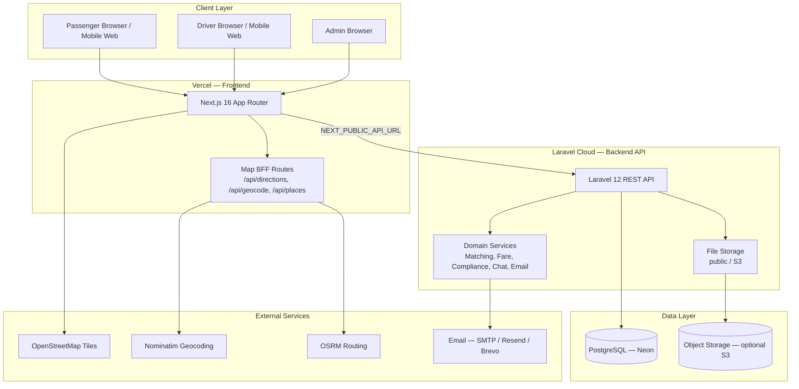
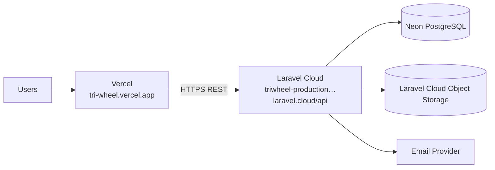
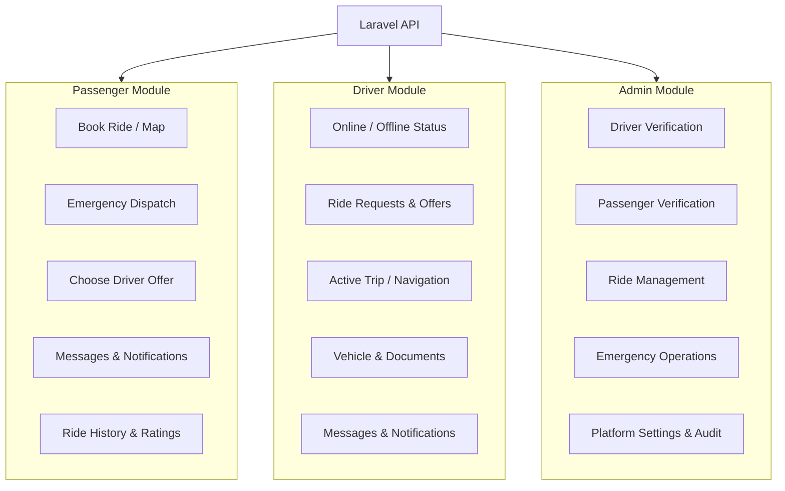
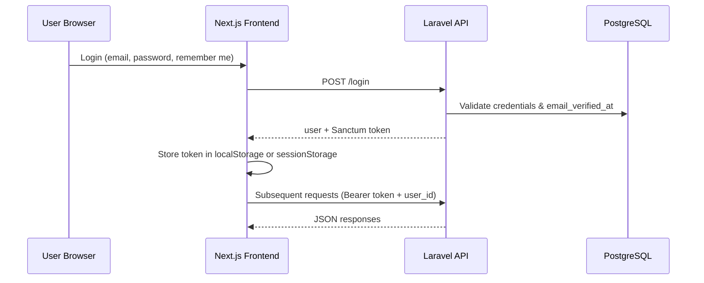
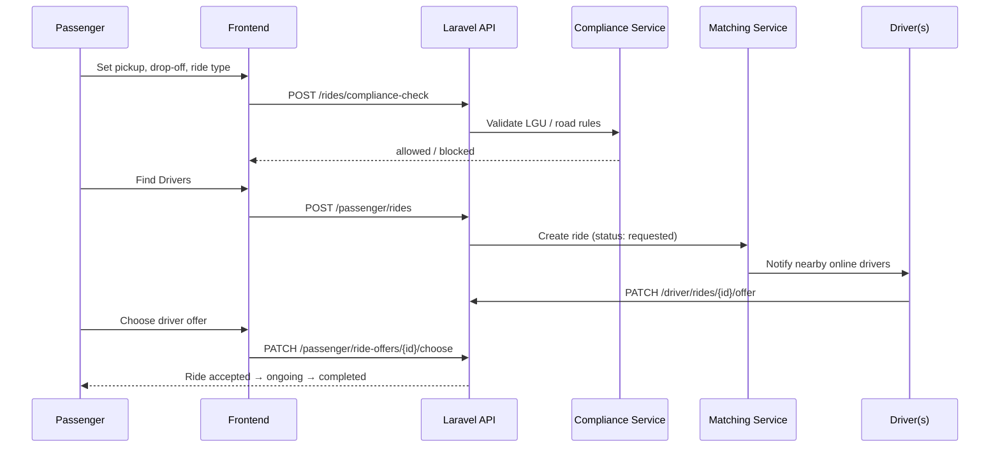
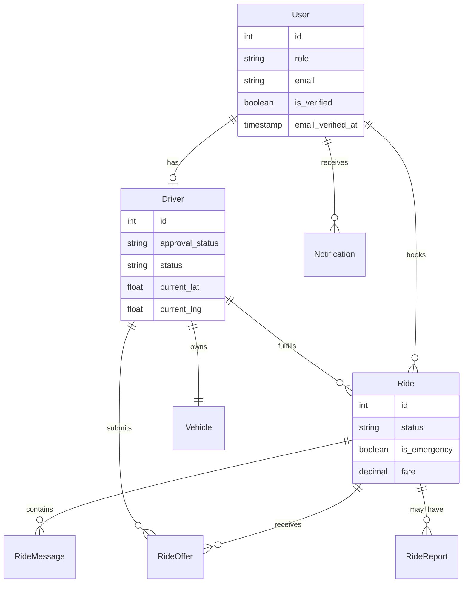
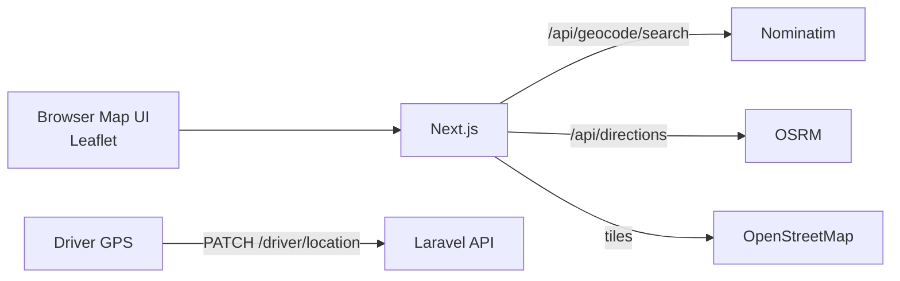

# TriWheel System Architecture

TriWheel is a local ride-hailing platform for tricycles, pedicabs, and e-tricycles. The system connects **passengers**, **drivers**, and **admins** through a web application with map-based booking, driver matching, in-app messaging, and LGU-aware route compliance.

---

## 1. High-Level Architecture



---

## 2. Technology Stack

| Layer | Technology | Purpose |
|-------|------------|---------|
| Frontend | Next.js 16, React 19, TypeScript, Tailwind CSS 4 | Passenger, driver, and admin web UIs |
| Maps (UI) | Leaflet, react-leaflet | Interactive maps and markers |
| Maps (data) | Nominatim, OSRM, OpenStreetMap | Search, geocode, routing (no Google Maps) |
| Backend | Laravel 12, PHP 8.2+ | REST API, business logic, auth |
| Authentication | Laravel Sanctum | Bearer API tokens |
| Database (prod) | PostgreSQL on Neon | Persistent relational data |
| Database (local) | MySQL or SQLite | Development |
| Email | Laravel Mail (log / SMTP / Resend) | Verification, password reset, alerts |
| File uploads | Laravel `public` disk / S3 | Profile photos, IDs, vehicle documents |
| Hosting | Vercel + Laravel Cloud | Split frontend/backend deployment |

---

## 3. Repository Structure

```
TriWheel/
├── frontend/          Next.js application (Vercel)
│   ├── src/app/       App Router pages by role
│   ├── src/components/ Shared UI (maps, shell, dialogs)
│   ├── src/lib/       API client, auth, map helpers
│   └── src/hooks/     Polling, geolocation, refresh
├── backend/           Laravel API (Laravel Cloud)
│   ├── app/Http/Controllers/
│   ├── app/Services/
│   ├── app/Models/
│   ├── routes/api.php
│   └── database/migrations/
├── scripts/           Laravel Cloud build & deploy scripts
├── docs/              Architecture and flow diagrams
└── legacy-php/        Pre-migration PHP prototype (reference)
```

---

## 4. Deployment Architecture



### Frontend (Vercel)

- Build: `npm run build` in `frontend/`
- Config: `frontend/vercel.json` sets `NEXT_PUBLIC_API_URL`
- Browser calls the Laravel API directly in production

### Backend (Laravel Cloud)

- Build script: `scripts/laravel-cloud-build.sh` (Composer install, route cache)
- Deploy script: `scripts/laravel-cloud-deploy.sh`:
  - `php artisan migrate --force`
  - `php artisan storage:link`
  - `php artisan config:cache`

### Required production environment

| Service | Key variables |
|---------|----------------|
| Frontend | `NEXT_PUBLIC_API_URL` |
| Backend | `APP_KEY`, `DB_URL`, `FRONTEND_URL`, `MAIL_*`, optional `AWS_*` for S3 |

---

## 5. Application Modules by Role



### Frontend routes

| Role | Main routes |
|------|-------------|
| Public | `/`, `/login`, `/signup`, `/driver/register`, `/verify-email`, `/terms` |
| Passenger | `/passenger`, `/passenger/history`, `/passenger/messages`, `/passenger/notifications` |
| Driver | `/driver`, `/driver/requests`, `/driver/vehicle`, `/driver/history`, `/driver/messages` |
| Admin | `/admin`, `/admin/drivers`, `/admin/passengers`, `/admin/rides`, `/admin/settings` |

---

## 6. API Architecture

All endpoints are defined in `backend/routes/api.php`.

| Group | Examples | Description |
|-------|----------|-------------|
| Auth | `POST /login`, `/logout`, `/passenger/register`, `/driver/register` | Login, registration, email verification |
| Account | `GET/PATCH /account/profile`, `/account/password` | Profile and password management |
| Passenger | `GET /passenger/overview`, `POST /passenger/rides`, `POST /passenger/rides/emergency` | Dashboard and booking |
| Driver | `GET /driver/overview`, `PATCH /driver/status`, `PATCH /driver/location` | Dashboard, availability, GPS |
| Rides | `PATCH /rides/{id}/cancel`, `GET /rides/{id}/messages` | Shared ride lifecycle and chat |
| Compliance | `POST /rides/compliance-check`, `GET /service-zones` | LGU / road rules validation |
| Admin | `/admin/drivers`, `/admin/rides`, `/admin/settings`, `/admin/audit-logs` | Platform administration |
| Notifications | `GET /notifications`, `PATCH /notifications/{id}/read` | In-app alerts |

### Development API proxy

In local dev, the frontend uses `/triwheel-api/*` which proxies to `http://127.0.0.1:8000/api` so the browser avoids CORS issues.

---

## 7. Authentication & Session Flow



| Feature | Behavior |
|---------|----------|
| Token storage | `localStorage` if Remember me; `sessionStorage` if not |
| Token lifetime | 30 days (remember) or 12 hours (session) |
| Email verification | Required before login for new accounts |
| Terms acceptance | Required at registration; stored with timestamp |
| Logout | Clears tokens; passenger logout cancels active ride searches |

**Note:** Most API endpoints also accept `user_id` in query/body. Admin routes use `ResolvesAdminUser` with Bearer token or `user_id`.

---

## 8. Core Business Flows

### 8.1 Normal ride booking



### 8.2 Emergency dispatch

- Passenger triggers **Emergency Ride** with pickup only (drop-off optional)
- `EmergencyDispatchService` bypasses compliance and ride-type filter
- Auto-assigns nearest online tricycle/e-tricycle driver not on another trip

### 8.3 Driver onboarding

1. Driver registers with documents (license, TODA, vehicle, OR/CR)
2. Email verification required
3. Application status: **pending** until admin approves
4. Approved drivers can go **online** and receive ride requests

---

## 9. Data Model (Core Entities)



### Ride status lifecycle

```
requested → accepted → ongoing → completed
     ↓           ↓
  cancelled   cancelled
```

---

## 10. Real-Time Strategy

TriWheel does **not** use WebSockets. Live updates use **HTTP polling**:

| Feature | Interval | Hook / component |
|---------|----------|------------------|
| Dashboard refresh | 5–8 seconds | `useLiveDashboardRefresh` |
| Driver GPS sync | 3–8 seconds | `useDriverLocationSync` |
| Notification bell | 15 seconds | `NotificationBell` |
| Ride chat | 10 seconds | `RideMessagesDashboard` |
| Admin live map | 8 seconds | Admin map page |

Refresh also runs on `window.focus` and tab visibility change.

---

## 11. Map & Geolocation Architecture



Map API routes run server-side in Next.js to avoid exposing third-party endpoints and to normalize responses.

---

## 12. Notifications & Email

| Channel | Use case |
|---------|----------|
| In-app notifications | Ride updates, offers, cancellations, admin actions |
| Email | Account verification, password reset, selective account alerts |

- Notifications stored in `notifications` table
- Frontend: `NotificationBell`, `NotificationsPanel`
- Email templates: `TriWheelAlertMail` (Blade view)

---

## 13. Security & Compliance

| Area | Implementation |
|------|----------------|
| Password policy | Minimum 6 characters, confirmation required |
| Email verification | Token link, 24-hour expiry |
| Terms & Conditions | Must be viewed and accepted at registration |
| Road compliance | `RoadRestrictionService` + `RideComplianceController` |
| Driver verification | Admin approval before going online |
| File access | Authenticated `/api/files/{path}` for uploaded documents |
| CORS | Restricted to `FRONTEND_URL` and Vercel preview origins |

---

## 14. Key Services (Backend)

| Service | Responsibility |
|---------|------------------|
| `RideMatchingService` | Match passengers with nearby drivers |
| `EmergencyDispatchService` | Urgent auto-assignment |
| `FareService` | Fare calculation by vehicle type |
| `RoadRestrictionService` | LGU / highway compliance rules |
| `RideChatService` | In-ride messaging (24h window from accept) |
| `NotificationService` | In-app notification delivery |
| `EmailVerificationService` | Registration email verification |
| `DriverSuspensionService` | Driver suspension and appeals |
| `AdminAuditService` | Admin action logging |

---

## 15. Production URLs (Reference)

| Component | URL |
|-----------|-----|
| Frontend | https://tri-wheel.vercel.app |
| Backend API | https://triwheel-production-phnsqu.laravel.cloud/api |
| Health check | `{API_URL}/health` |

---

## 16. Future Architecture Considerations

- **Strict API auth:** Enforce Sanctum middleware on all protected routes instead of `user_id`-only checks
- **WebSockets / SSE:** Replace polling for active rides and chat if scale requires it
- **Mobile apps:** Reuse the same REST API with native clients
- **Push notifications:** FCM/APNs layer on top of existing notification service
- **Payment gateway:** Integrate between ride completion and fare settlement

---

*Document version: June 2026 — aligned with TriWheel monorepo on `main`.*
